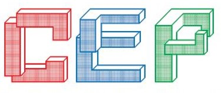
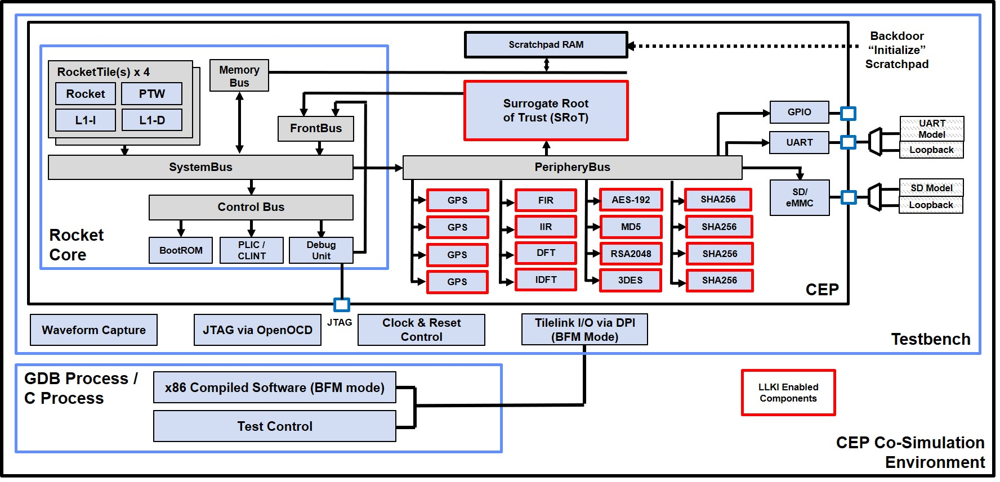
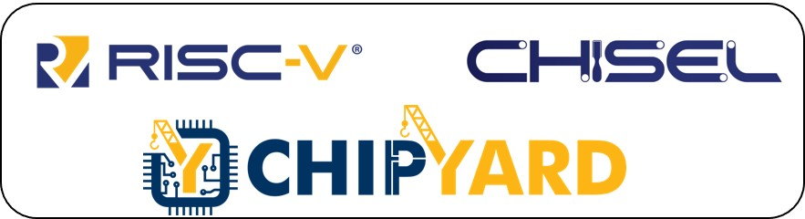

[//]: # (Copyright 2022 Massachusetts Institute of Technology)
[//]: # (SPDX short identifier: BSD-2-Clause)

# Common Evaluation Platform v4.0

[](https://zenodo.org/badge/latestdoi/108179132)
[](https://opensource.org/licenses/BSD-2-Clause)

<p align="center">
    
</p>
<p align="center">
   Copyright 2022 Massachusetts Institute of Technology
</p>
<p align="center">
   
</p>
<p align="center">
    
</p>

The Common Evaluation Platform (CEP) is an SoC design that contains only license-unencumbered, freely available components.  The CEP includes a range of accelerator cores coupled with a key delivery mechanism, and parametrically-defined challenge modules which can be synthesized to support developmental testing. The implementation of the CEP includes a comprehensive verification environment to ensure modifications do not impede intended functionality. It is intended to be targeted to either an FPGA or ASIC implementation. 

Beginning with CEP v4.0, the platform has been ported to the UCB Chipyard Framework.  The original Chipyard Readme can be found [here](./README.Chipyard.md).

Throughout the CEP READMEs, `<CEP_ROOT>` refers to the root directory of the cloned CEP repository.

## Pre-requisites (validated test/build configurations):
The following items describe the configuration of the system that CEP has been developed and tested on:
* Ubuntu 18.04 LTS x86_64 with Modelsim Questa Sim-64 v2019.1 (for co-simulation)
* Red Hat Enterprise Linux 7 with Cadence XCELIUMAGILE20.09.001, VMANAGERAGILE20.06.001
* Xilinx Vivado 2020.1 (needed for building FPGA targets)
  - Plus Digilent Adept Drivers for programming the FPGA target, https://reference.digilentinc.com/reference/software/adept/start?redirect=1#software_downloads)
* Terminal emulator (such as `minicom`)
* bash

Other configurations may work, but they have not been explicitly verified.

Instructions on how to modelsim, xcelium, and Vivado are beyond the scope of this README.

## Setting up your environment

To build the CEP, several packages and toolsets must be installed and built.  The typical steps are listed below.  Additional information can be found in the Chipyard Documentation at https://chipyard.readthedocs.io/

A note about proxies: If your system is behind a proxy, you'll want to ensure your environment is properly configured.  Exact details vary by system, but the proxy needs to be available to apt / yum, curl, and sbt (Simple Build Tool for Scala)

If using RHEL7, you need to ensure gcc 7.x.x+ is installed.  This can be found in the `rhel-workstation-rhscl-7-rpms`  or `rhel-server-rhscl-7-rpms` repos, whose available is RHEL subscription dependent.  Once the repo is enabled, the appropriate gcc can be installed by running `sudo yum install devtoolset-7-gcc-c++`.  Once installed, you want to run `scl enable devtoolset-7 bash` (or whatever version you have installed) to ensure g++ maps to the new version.

* Install git if not already present on your system
  * Ubuntu - `sudo apt install git`
  * RHEL7  - `sudo yum install git`
* Clone the CEP repository, change to the directory of the clone
  * `git clone https://github.com/mit-ll/CEP.git`
* Install package dependencies.  Copies of these files can also be found in the Chipyard Documentation listed above
  * Ubuntu - `./scripts/ubuntu-reqs.sh`
  * RHEL7  - `./scripts/centos-reqs.sh`
* Initialize all the git submodules (including FPGA-related submodules)
  * `./scripts/init-submodules-no-riscv-tools.sh`
  * `./scripts/init-fpga.sh`
* Build the RISC-V Toolchain.  
  * Depending on your available hardware, you can expedite the build by executing `export MAKEFLAGS=-jN` prior to running the build script.  N is the number of cores you can devote to the build
  * `./scripts/build-toolchains.sh riscv-tools`
* The chipyard build needs make v4.x or later, which is not included in the default packages.  Recommend building from source (https://ftp.gnu.org/gnu/make/).  Once installed, you can force the version of make used using the following: `MAKE=/usr/local/bin/make ./scripts/build-toolchains.sh riscv-tools`
* It is advisable to move the compiled toolchain outside of the current repo if you plan to have multiple CEP working directories.  Complete directions are beyond the scope of this document, but they do include moving the `riscv-tools-install` directory and `env-riscv-tools.sh` file.  Modification of the aforementioned file as well as `env.sh` will required for smooth operation
* Sometimes the toolchain build may fail.  One may need to run the build several times.
* Once the toolchain is built, your want to source the new environment script: `source <CEP_ROOT>/env.sh`.

## Repository Directory Structure
Providing a complete directory structure is impractical, but some items are highlighted here.  It is worth noting that most of the structure is inherited from Chipyard.

```
<CEP_ROOT> 
  |- ./sims/cep_cosim/ -  
  |     Defines the CEP co-simulation evironment for performing "chip" level simulations of the CEP in 
  |     either bare metal or bus functional model (BFM) mode.  
  |- ./generators/mitll-blocks/
  |   |- src/main/scala - Contains all the custom CEP Chisel code
  |   |- src/main/resources/vsrc/ - SystemVerilog / Verilog files associated with the CEP build
  |       |- generated_dsp_code - Location to place the `dft_top.v` and `idft_top.v'
  |       |- opentitan  - Soft-link to the opentitan submodule located at ./opentitan
  |       |- aeees      - Challenge module.  Read the README.md in this directory for more information.
  |       |- auto-fir   - Challenge module.  Read the README.md in this directory for more information.
  |       |- shaaa      - Challenge module.  Read the README.md in this directory for more information.
  |- ./cep_docs - Documents and images unique to the CEP
  |- ./software/baremetal - Examples of bare metal code that can be run on the Arty100T FPGA target
                            independent of the CEP Co-Simulation environment
```

### Building the CEP FPGA
In addition to those included with Chipyard, multiple Chipyard *SUB_PROJECTS* have been defined for the CEP.  

For the Arty-A7 100T FPGA board, the `cep_arty100t` *SUB_PROJECT* has been defined in `<CEP_ROOT>/fpga/Makefile`.

With v4.0, the following FPGA configurations have been defined with the CEP-unique additions listed:

`cep_arty100t`
- CEP Registers
- 1 x AES Core
- Surrogate Root of Trust (SRoT)

`cep_min_arty100t`
- CEP Registers

Assuming the Vivado environment scripts have been sourced within your current shell, the following commands can be used to build and program the FPGA *SUB_PROJECT*.  Programming requires that the digilent drivers have been installed and that you have a USB connection to the micro-USB port on the Arty100T.

Default CEP builds can be customized by following the instructions in the Chipyard documentation.

The Arty100T will configure from FLASH or JTAG based on the state of the MODE jumper.  Additional information on the Arty board can be found [here](https://digilent.com/shop/arty-a7-artix-7-fpga-development-board/).


```
cd <REPO_ROOT>/fpga
make   # cep_arty100t is the default SUB_PROJECT

./program_arty100t_flash.sh - Create the MCS file & program the Arty100T FLASH.  Power needs to be cycled or the *PROG* button needs to be asserted to reboot with the new configuration.

OR

./program_arty100t_jtag.sh - Program the FPGA via JTAG.  System will automatically reset or you can use the *RESET* button.
```

### Building software for the CEP FPGA

In additional to connecting USB to the Arty100T's microUSB port, a Digilent SD or microSD PMOD connected should be connected to connector JA.  The PMOD connectors can be ordered from Digikey, Digilent, or other distributors.
Additional information can be found here: (https://digilent.com/shop/pmod-sd-full-sized-sd-card-slot/ or https://digilent.com/shop/pmod-microsd-microsd-card-slot/).

It should be noted that the microUSB port uses an FTDI chip to provide both JTAG and UART functionality.  Your system may differ, but typically the UART shows up as `/dev/ttyUSB0` or `/dev/ttyUSB1`.  UART settings are 115200baud, 8N1 and should be visible to any terminal program.

Once released from reset, the CEP's bootrom will read the baremetal executable from the SD card, copy it DDR memory, and then jump to that location and execute the program.

An example UART output for the gpiotest is included below:
```
---    Common Evaluation Platform v00000004.00000000     ---
--- Copyright 2022 Massachusetts Institute of Technology ---
---     BootRom Image built on Jun 13 2022 07:22:08      ---
INIT
CMD0
CMD8
ACMD41
CMD58
CMD16
CMD18
LOADING 0x00080000 PAYLOAD
LOADING  
BOOT


------------------
 RISC-V GPIO Test 
------------------


switches = 00000000
switches = 00000004
switches = 00000005
switches = 00000001
switches = 00000000
```

A developer may use baremetal software from the CEP cosimulation or the examples as provided in `<CEP_ROOT>/software/baremetal`.  

In either case, it is important to note what device your (micro)SD card gets mapped to (e.g., `/dev/sdd`).

As of v4.0, the cosimulation baremetal software does not currently support the console printfs, thus feedback of test results will be minimal.  It is intended to provide an option for building an FPGA version of the software (vs simulation) which will overload the I/O functions according.  Furthermore, many of the bareMetal tests presume the `CEPRocketConfig` configuration, which contains substantially more functionality than can fit on the Arty100T.  As a result, many of the cosimulation tests will require substantial modification to run properly on the FPGA.  

Using `<CEP_ROOT>/sims/cep_cosim/testSuites/bareMetal/regTest` as an example, the following steps will build and load the executable onto the (micro)SD card.

```
cd <CEP_ROOT>/sims/cep_cosim/testSuites/bareMetal/regTest
make riscv_wrapper        						<-- builds riscv_wrapper.img
make DISK=/dev/sdd riscv_wrapper_sd_write		<-- copies riscv_wrapper.img to /dev/sdd (subsitute with your device name)
```

The steps in `<CEP_ROOT>/software/baremetal/gpiotest` are slight different.

```
cd <CEP_ROOT>/software/baremetal/gpiotest
make DISK=/dev/sdd sd_write        				<-- copies gpiotest.img to /dev/sdd (subsitute with your device name)
```

It is worth noting that the examples in `<CEP_ROOT>/software/baremetal` do not require the compilation of the all the cosimulation libraries, but as a result, will not have access to those support functions.

### CEP Co-Simulation

For simulation using the CEP Co-Simulation environment, the `cep_cosim` and `cep_cosim_asic` *SUB_PROJECTS* are defined in `<CEP_ROOT>/variables.mk`.  At this time, due to licensing constraints, the CEP ASIC build is not available as part of this repository.  As a result, any attempt to build it will fail given that a multitude of files are missing.  

Instructions on the CEP Co-Simulation (including the Chipyard build) can be found [here](./sims/cep_cosim/README.md).

### Generated DSP code notes
Due to licensing contraints, two of the DSP cores used during CEP development cannot be included in our repository.  Instructions on generating all the cores can be found [here](./generators/mitll-blocks/src/main/resources/vsrc/dsp/README.md)

Please check the [CEP changelog](./CHANGELOG.CEP.md) to understand what has changed and a list of known issues.

## Errors? Ommissions? Questions?
Please feel free to file a github issue which the CEP developers check frequently.

## Licensing
As the CEP has been developed with input from many sources, multiple licenses apply.  Please refer to the following files for licensing info. 
* [CEP License](./LICENSE.md)
* [CEP Components Licenses](./LICENSE.md)
* [Chipyard License](./LICENSE.md)
* [SiFive License](./LICENSE.SiFive.md)


## DISTRIBUTION STATEMENT A. Approved for public release. Distribution is unlimited.
This material is based upon work supported by the Defense Advanced Research Projects Agency under Air Force Contract No. FA8702-15-D-0001. Any opinions, findings, conclusions or recommendations expressed in this material are those of the author(s) and do not necessarily reflect the views of the Defense Advanced Research Projects Agency.

© 2022 Massachusetts Institute of Technology

The software/firmware is provided to you on an As-Is basis.

Delivered to the U.S. Government with Unlimited Rights, as defined in DFARS Part 252.227-7013 or 7014 (Feb 2014). Notwithstanding any copyright notice, U.S. Government rights in this work are defined by DFARS 252.227-7013 or DFARS 252.227-7014 as detailed above. Use of this work other than as specifically authorized by the U.S. Government may violate any copyrights that exist in this work
