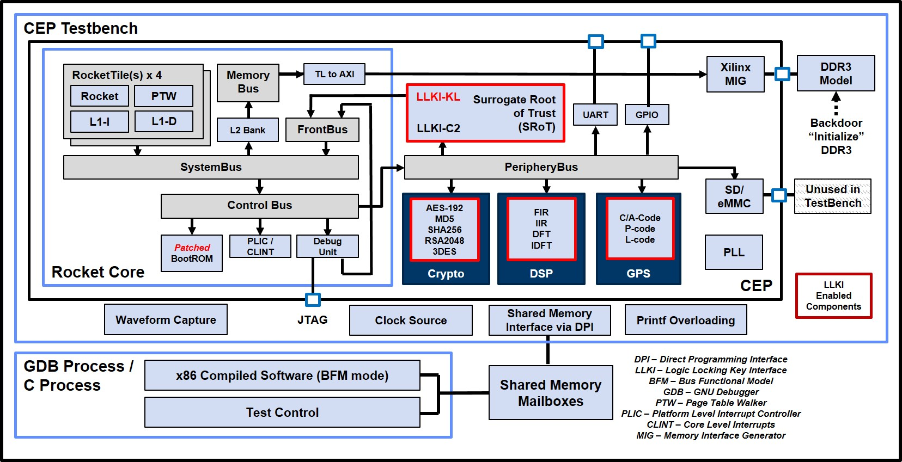

[//]: # (Copyright 2021 Massachusetts Institute of Technology)
[//]: # (SPDX short identifier: BSD-2-Clause)

[](https://zenodo.org/badge/latestdoi/108179132)
[](https://opensource.org/licenses/BSD-2-Clause)

<p align="center">
    
</p>
<p align="center">
    
</p>
<p align="center">
   Copyright 2021 Massachusetts Institute of Technology
</p>
<p align="center">
    
</p>

The Common Evaluation Platform (CEP) is intended as a surrogate System on a Chip (SoC) that provides users an open-source evaluation platform for the evaluation of custom tools and techniques.  An extensive verification environment is provided to ensure the underlying functionality is maintained even after modification.

The Logic Locking Key Interface (LLKI) has been provided as a representative means of distributing key / configuration material to LLKI-enabled cores.  

For CEP v3.1+, the full LLKI has been added.  This includes the Surrogate Root of Trust (SRoT) and mock Technique Specific Shims (TSS) for all accelerator cores.

### Please check the [Release Notes](./RELEASE_NOTES.md) to understand what has changed and a list of known issues.

<br/>

<p align="center">
    
</p>

The CEP is based on the SiFive U500 Platform which leverages the UCB Rocket Chip.  Much of the design is described in Chisel (https://github.com/freechipsproject/chisel3), a domain specific extension to Scala tailored towards constructing hardware.  The output of the Chisel generators is synthesizable verilog.

Currently, the test platform for the CEP is the Xilinx VC-707 FPGA Development Board.  Longer term plans include migrating to other platforms with the eventual goal of taping out an ASIC.


## Additional Sources of Information
* Freedom U500 VC707 FPGA Dev Kit Getting Started Guide  - https://www.sifive.com/documentation
* Chisel Wiki                                            - https://github.com/freechipsproject/chisel3/wiki
* Chisel Bootcamp                                        - https://github.com/freechipsproject/chisel-bootcamp
* Chisel Cheatsheet                                      - https://chisel.eecs.berkeley.edu/2.2.0/chisel-cheatsheet.pdf
* Addition Chisel info from UCB                          - https://chisel.eecs.berkeley.edu/
* UCB Rocket Chip                                        - https://github.com/chipsalliance/rocket-chip
* Freedom U500 Repository                                - https://github.com/sifive/freedom
* Freedom Unleased Software Development Kit              - https://github.com/sifive/freedom-u-sdk
* Chipyard Documentation                                 - https://readthedocs.org/projects/chipyard/

## Pre-requisites (validated test/build configuration):
The following items describe the configuration of the system that CEP has been developed and tested on:
* Ubuntu 16.04 LTS x86_64 / Ubuntu 18.04 LTS x86_64 [RECOMMENDED]
* Modelsim Questa Sim-64 v2019.1 (for co-simulation and unit simulation)
* Xilinx Vivado 2018.3 (Design or System Edition)
  - Plus Digilent Adept Drivers for programming the VC-707, https://reference.digilentinc.com/reference/software/adept/start?redirect=1#software_downloads)
* Terminal emulator (such as `minicom`)
* bash

Other versions/combinations may work, but they have not been explicitly verified.


## Cloning the CEP Repository and Getting External Dependencies
Before proceeding, you'll need to install curl if it is not already installed on your system:

```
sudo apt install curl
```

After cloning the CEP repository from https://github.com/mit-ll/CEP, you will need get the external dependencies (respositories) that have not been included directly within the CEP repository (git submodules are not used).

First, run the following:
```sh
./get_external_dependencies.sh all
```

As noted by the script, many directories will be created/overwritten by this command.  Any local changes to these directories will be lost.  Additional usage info can be found by just running the script without any parameters.


## Setting up your environment

To build the CEP, several packages and toolsets must be installed and built.  Follow the steps listed below.

While Ubuntu 16.04 LTS is supported, it is End of Life as of April 2021.  Thus, Ubuntu 18.04 LTS is recommended.

### Installing Vivado and Modelsim
It is assumed that Vivado and Modelsim are installed on your system.  It is noted that some of the libraries pulled in after sourcing the environmental script (e.g., `/opt/Xilinx/Vivado/2018.3/settings64.sh`) can conflict with the RISC-V toolchain build process.  It is recommended that you not source this file in the bash shell you use to build the RISC-V tools.

Modelsim is required if you intend to run the co-simulation or unit-simulation environments located in `<CEP_ROOT>/cosim` and `<CEP_ROOT>/unit_simulation` respectively.  Version 2019.1 is recommended.  Other simulators or versions may work, but they have not been explicitly tested.


### Install the RISC-V GNU Toolchain
The RISC-V source code resides in <CEP_ROOT>/software/riscv-gnu-toolchain

Begin by installing the dependencies by executing the following:
`sudo apt install autoconf automake autotools-dev curl python3 libmpc-dev libmpfr-dev libgmp-dev gawk build-essential bison flex texinfo gperf libtool patchutils bc zlib1g-dev libexpat-dev`

Now, build the toolchain.  

Ensure you have write permissions to the directory pointed to by $RISCV and that the current shell has NOT sourced the Xilinx Vivado environment script.

```
    $ cd <CEP_ROOT>/software/riscv-gnu-toolchain
    $ ./configure --prefix=/opt/riscv
    $ make -jN                                   (Where N is the number of cores that can be devoted to the build)
```

#### Ubuntu 18.04 LTS instructions

Default openssl version is 18.04 is different than 16.04.  Install the following additional package.
`sudo apt install libssl1.0-dev`

You'll also need to force the compilation of the riscv-toolchain with GCC-5, which is not installed by default.

First, install gcc-5
```
sudo apt install gcc-5
```

Second, you'll need to build the toolchain while forcing the GCC compiler version.

```
    $ cd <CEP_ROOT>/software/riscv-gnu-toolchain
    $ ./configure CC=gcc-5 --prefix=/opt/riscv
    $ make CC=gcc-5 -jN                                   (Where N is the number of cores that can be devoted to the build)
```

Now with the tools installed, you'll want to add them to your path:
```
    $ export RISCV=/opt/riscv
    $ export PATH=$PATH:$RISCV/bin
```

### Install Scala
Next, you need to install Scala which is required by Chisel.

1. Install Java
  
    ```
    sudo apt install default-jdk
    ```

2. [Install sbt](http://www.scala-sbt.org/release/docs/Installing-sbt-on-Linux.html),
    which isn't available by default in the Ubuntu system package manager:
    ```
    echo "deb https://dl.bintray.com/sbt/debian /" | sudo tee -a /etc/apt/sources.list.d/sbt.list
    sudo apt-key adv --keyserver hkp://keyserver.ubuntu.com:80 --recv 642AC823
    sudo apt-get update
    sudo apt-get install sbt
    ```

### Install Feedom-U-SDK dependencies
Install the required dependencies by running the following command:
`sudo apt install build-essential git texinfo bison flex libgmp-dev libmpfr-dev libmpc-dev gawk libz-dev libssl-dev python unzip libncurses5-dev libglib2.0-dev libpixman-1-dev device-tree-compiler`

## Repository Directory Structure (highlight)
```
<CEP_ROOT> 
  |- cosim/ - Defines the CEP co-simulation evironment for performing "chip" level 
  |            simulations of the CEP in either bare metal or bus functional model 
  |            (BFM) mode.  Dependent on the building of the CEP hardware (described
  |            below).  Refer to the README.md file in this directory for more information.
  |
  |-- unit_simulation/ - Unit-level testbenches for the CEP cores
  |
  |-- get_external_dependencies.sh - Script used to fetch external CEP dependencies.
  |
  |-- hdl_cores/ - Source for all the components within the CEP.  All the blocks that 
  |     |          implement algorithms also have corresponding test vectors.
  |     |
  |     |-- freedom - CEP-modified variant of the Freedom U500 platform
  |     |     |
  |     |     |-- mitllBlocks - Chisel code for the CEP cores
  |     |
  |     |-- llki - LLKI SystemVerilog files
  |
  |-- generated_dsp_code/  - Placeholder for the generated DSP code that cannot be
  |                          directly included in the CEP repository due to licensing
  |                          restrictions.
  |
  |-- opentitan/           - Copy of the OpenTitan repository, some components are used by the LLKI.
  |
  |-- software/        
        |
        |-- freedom-u-sdk/ - Directory containing an export of the https://github.com/
        |                    mcd500/freedom-u-sdk directory, which is a fork of the 
        |                    main SiFive repo.  Variant specifically chosen because it 
        |                    has been modified to boot without PCIe support (which for 
        |                    the VC-707 requires a HiTech Global HTG-FMC-PCIE module).
        |
        |-- riscv-gnu-toolchain/  - RISC-V GNU toolchain
        |-- riscv-tests           - RISC-V tests (used for importing into the cosimulation environment)

```

## Note regarding the Logic Locking Keying Interface (LLKI) and the Surrogate Root of Trust (SRoT)
The SRoT is a SINGLE THREADED DEVICE.

As such, care should be taken when using the SRoT in a multi-core environment.  Multiple cores should NOT access the SRoT at the same time.

As of CEP v3.1+, all cores have been LLKI-enabled.  Thus, they must be initialized with the appropriate mock keys.

See ./cosim/drivers/diag/cepMacroMix.cc for example code. 

## Note regarding endianess

As one might be aware: the endianess usage is not consistent thru out the design, expesially where Chisel wrappers are used to connect to various HW cores. For some cores, little endian is used for loading keys/plain text but big-endian is used to produce cipher text as output. This creates confusion and inconsistent as one might try to understand/follow SW driver for these cores. Also, please note, RISCV is little endian.

As of release CEP v2.4 and later, unless otherwise specify, big endian is used thru out the design to match key/plain/ciphertext network order.

This makes it consistent and easier to debug when key/plain text are printed to match against registers.

```
For example: As key/plain/ciphertext have the following network order format (big-endian, read left-to-right) :

    byte0 , byte1, byte2, byte3, .... byteN

They will be mapped to the design's registers as follows:
    
For 64-bit registers:
--------------------

                        63                                                             0
                       +-------+-------+-------+-------+-------+-------+-------+--------+           
   register Offset 0x0 | byte0 | byte1 | byte2 | byte3 | byte4 | byte5 | byte6 | byte7  |
                       +-------+-------+-------+-------+-------+-------+-------+--------+
   register offset 0x8 | byte8 |   ....                                        | byte15 |
                       +-------+-------+-------+-------+-------+-------+-------+--------+
                   ... | ....                                                           |

For 32-bit registers: (right-justify if maps to 64-bit offset)
--------------------    
                                                     31                            0
                                                        +-------+-------+-------+-------+
                                    register Offset 0x0 | byte0 | byte1 | byte2 | byte3 | 
                                                        +-------+-------+-------+-------+
                                    register offset 0x4 | byte4 |   ....        | byte7 |
                                                        +-------+-------+-------+-------+
                                                    ... | ....                          |
```

## Note regarding DSP cores
Due to licensing, the verilog source for the DFT and IDFT components are not included with the CEP repository.  Instructions for generating these cores can be found in the [./hdl_cores/dsp/README.md](./hdl_cores/dsp/README.md) file.  Scripts assume that the generated verilog has been placed in `<CEP_ROOT>/generated_dsp_code`.


## Building the CEP
Configure your VC-707 with the following DIP switch settings (SW11):

```
-----------------------
|         SW11        |
| --- --- --- --- --- |
| | | | | | | |*| | | |
| |*| |*| |*| | | |*| |
| --- --- --- --- --- |
|  1   2   3   4   5  |
|                     |
-----------------------
```

The following steps assume the aforementioned prerequisites have been installed and all external dependencies have been fetched.

There are two primary build steps for the CEP, the hardware and the software.


### Building the Hardware
Ensure that you have sourced the setup scripts for Xilinx Vivado 2018.3.

Example : `source /opt/Xilinx/Vivado/2018.3/settings64.sh`

Change to the `<CEP_ROOT>/hdl_cores/freedom` directory and execute the following commands:

```sh
$ make -f Makefile.vc707 verilog
$ make -f Makefile.vc707 mcs      # Build the FPGA bitstream
            OR 
$ make -f Makefile.vc707 sim      # Build only the IP simulation models (for the cosim environment)
```

Build time will vary based on the machine, but could be in the range of 1 to 2 hours.  The first step will create the Chisel-generated verilog with the second creating the bitfile for the VC-707.

Following the build process and assuming the [Digilent Adept 2 drivers](https://reference.digilentinc.com/reference/software/adept/start?redirect=1#software_downloads) have been installed, you can program a VC-707 attached via USB using the following script:

```sh
./program_card.sh
```

### A Few Notes about the Generated Address Map ###

- Each address space has a series of permissions associated with it.
  They are defined as follows (from [[freechips.rocketchip.diplomacy.ResourcePermissions]]):

```
    A - Supports all Atomic Operations
    R - Readable
    W - Writable
    X - Executable
    C - Cacheable
```

### Bulding CEP Diagnostics Software ###

Leveraging the CEP Diagnostics written for CEP co-simulatlion, run the following steps to install the diagnostics into the freedom-u-sdk linux build.

```sh
cd <CEP ROOT>/cosim
make build_v2c                    <-- Required: Generate C header files from Verilog needed by cep_diag
cd <CEP ROOT>/cosim/drivers/linux
make install append
```

If subsequent changes are made to the source code in <CEP_ROOT>/cosim/drivers/linux, simply copy the changes over to the Linux build by running `make install`.

Next, one needs to build linux.  First, change to the `<CEP ROOT>/software/freedom-u-sdk` directory.  Ensure that the linux variant of the RISC-V toolset is used by executing `unset RISCV`

For Ubuntu 18.04 LTS, the default PERL installation may cause a conflict with the build process.  You may need to execute `unset PERL_MM_OPT` if set.

Begin the build by running `make -jN BOARD=vc707devkit_nopci all` where N is the numbers of cores you can dedicate to the build.  Ensure that you have NOT sourced the Xilinx Vivado environment setup script before running this step.

Following the linux build, which can take 30 - 60 minutes, you will have a binary which you can load onto an SD card.

The SD card can be loaded by executing `sudo make DISK=/dev/<your SD card> vc707-sd-write` where you need to know what device your SD card is mapped to.

Before booting the CEP, you'll want to connect to the VC-707's UART (via USB).  This device is typically mapped to `/dev/ttyUSBN` when N can be 0, 1, or 2.  Check you `/dev/` directory following connecting the UART to see which device enumerates.

Install the newly programmed SD card into the VC-707.

You'll then want to connect via a terminal program with the following parameters: `115200 baud, 8N1, no flow control`

You should see the following logo/text appear:

```                                                                
          ::::::::::::::/+   `....-----------:/-     ....-:::::::/+
       ...o+++++++++++++o:  :/--:-/++o+++o+++/-`   ..  `..++++++++:
       -o++o++///////++++o:  +o++o`/...........    +:::/. .:::::o++:
       -++++--       :+++o: `oo++o`/.........:/   `o+++o`:    -+++o:
       -++++--       -:::/. +o+++o`/++o+++o+o-:   `o+++/.-....++o:-
       -++++--              +oo++o.://///////-`   `o+o+o+++o++o+o:.
       -++++--      `.....  +oooo-/               `o+ooo//:/::::/-
       -o+++-:.....:/::::/  +oo+o :`````````````  `s+++s`-
       -++++-::::::/++/++:  ++++o//////////////:- `o+++o`-
       ./+++++++++++oo+++:  +oo++o++++o+o+oo+oo.- `s+++s`-
       .--:---:-:-::-::`  -::::::::::::::::::.   :::::.

                      Common Evaluation Platform v3.30
         Copyright 2021 Massachusetts Institute of Technology

            Built upon the SiFive Freedom U500 Platform using
             the UCB Rocket Chip targeting the Xilinx VC-707

...

LOADING /
```

The CEP will then begin booting linux assuming your SD card has been properly built as described above. 


## Using the CEP

Following the linux boot, you should be presented with a login prompt.  Credentials are the same as the freedom-u-sdk defaults, username: `root` and password `sifive`.

At the command prompt, you can run the CEP diagnostics by commanding `cep_diag`.

A partial output should be similar to:

```sh
*** CEP Tag=CEPTest CEP HW VERSION = v3.30 was built on Apr 15 2021 09:22:15 ***
 CEP FPGA Physical: cepReg/ddr3/other/sys -> Virtual=0x0000000700000000, 0x0000000800000000, 0x0000000600000000, 0x0000000c00000000 ScratchPad=0x0000002000800000
gSkipInit=0/0
gverbose=0/0
Setting terminal to VT102 with erase=^H
EnterCmd> menu
  ============== TEST MENU ==============
    0 : runAll               : Run all available tests
    1 : cacheFlush           : I+D-caches flush all cores (via self-mod-code)
    2 : cepThrTest           : Multi-thread tests (all cores)
    3 : dcacheCoherency      : D-cache coherency Test (all cores)
    4 : icacheCoherency      : I-cache coherency Test (all cores)
    5 : cepMaskromTest       : CEP Maskrom Read-Only Test (all cores)
    6 : cepSrotMemTest       : CEP SRoT memory test (single core) 
    7 : ddr3Test             : Main Memory Test (all cores)
    8 : smemTest             : Scratchpad Memory Test (all cores)
    9 : cepGpioTest          : CEP GPIO test (single core) 
   10 : cepSpiTest           : CEP SPI test (single core) 
   11 : cepSrotErrTest       : CEP SRoT Error Test (single core) 
   12 : cepAccessTest        : CEP various bus/size access test (all cores)
   13 : cepAtomicTest        : CEP atomic intructions test (all cores)
   14 : cepClintTest         : CEP CLINT register test (all cores)
   15 : cepLockTest          : CEP single lock test (all cores)
   16 : cepLockfreeAtomic    : CEP lock-free instructions test (all cores) 
   17 : cepLrscOps           : CEP Load-Reserve/Store-Conditional test (all cores)
   18 : cepMultiLock         : CEP multi-lock test (all cores)
   19 : cepPlicTest          : CEP PLIC register test (all cores)
   20 : cepRegTest           : CEP register tests on all cores
   21 : cepMacroBadKey       : CEP Macro tests with badKey (all cores)
   22 : cepMacroMix          : CEP Macro tests (all cores)
   23 : cepSrotMaxKeyTest    : CEP Macro tests with maxKey (single core)
   24 : cep_AES              : CEP AES test (single core)
   25 : cep_DES3             : CEP DES3 test (single core)
   26 : cep_DFT              : CEP DFT and IDFT test (single core)
   27 : cep_FIR              : CEP FIR test (single core)
   28 : cep_GPS              : CEP GPS test (single core)
   29 : cep_IIR              : CEP IIR test (single core)
   30 : cep_MD5              : CEP MD5 test (single core)
   31 : cep_RSA              : CEP RSA test (single core)
   32 : cep_SHA256           : CEP SHA256 test (single core)
EnterCmd> 
```

You should now have a functioning CEP!


## CEP Cores
The Freedom U500 platform has been extended to include several accelerator cores as depicted in the above block diagram.  Included with these cores are independately generate test vectors with a focus on increased coverage (see co-simulation and unit-simulation sections below)

The following cores have been integrated into the "standard" CEP build:
- AES-192
- Triple-DES
- MD5
- SHA-256
- RSA
- Discrete Fourier Transform
- Inverse Discrete Fourier Transform
- Finite Impulse Response
- Infinite Impulse Response
- GPS code generator

Beginning with the v2.4 release, the following "generated" cores have been added to the repository, but are currently not integrated into the CEP build.
- A(EE)ES-WB : Advanced Egregiously Extended Encryption Standard - Whitebox Edition [./hdl_cores/aeees/README.md](./hdl_cores/aeees/README.md).
- (RI)IIR : Randomly Indeterminate Infinite Impulse Response [./hdl_cores/auto-fir/README.md](./hdl_cores/auto-fir/README.md).

Reminder: Beginning with CEP v3.1, all the aforementioned cores have been Logic Locking Key Interface (LLKI) enabled, and thus must have the mock keys loaded to function properly.

 
## Co-Simulation
The primary documentation source for the CEP co-simulation environment can be found in [./cosim/README.md](./cosim/README.md).

It is worth highlighting that simulation is dependent on completing the `Building the Hardware` steps above.

The environment supports writing tests that can run in simulation or on the hardware itself.

See ./cosim/drivers/diag/cepMacroMix.cc for example code.

## Unit Simulation
The unit simulation testbenches allow for simulation of indivdual CEP cores without incurring the overhead of simulating
the entire CEP (RISC-V, DDR, etc.)

More information about the unit simulations can be found [./unit_simulation/README.md](./unit_simulation/README.md).


## Feedback
Feedback on the CEP is welcomed by the authors.  They are best contacted by opening a Github issue.


## Licensing
The CEP been developed with a goal of using components with non-viral, open source licensing whenever possible.  When not feasible (such as Linux), pointers to reference repositories are given using the [get_external_dependencies.sh](./get_external_dependencies.sh) script.  

Additional licensing information can be found in the [LICENSE](./LICENSE) and [licenseLog.txt](./licenseLog.txt) files.


## DISTRIBUTION STATEMENT A. Approved for public release: distribution unlimited.

© 2021 MASSACHUSETTS INSTITUTE OF TECHNOLOGY

Subject to FAR 52.227-11 – Patent Rights – Ownership by the Contractor (May 2014)
SPDX-License-Identifier: BSD-2-Clause

This material is based upon work supported by the Name of Sponsor under Air Force Contract No. FA8721-05-C-0002 and/or FA8702-15-D-0001. Any opinions, findings, conclusions or recommendations expressed in this material are those of the author(s) and do not necessarily reflect the views of the Name of Sponsor.

The software/firmware is provided to you on an As-Is basis