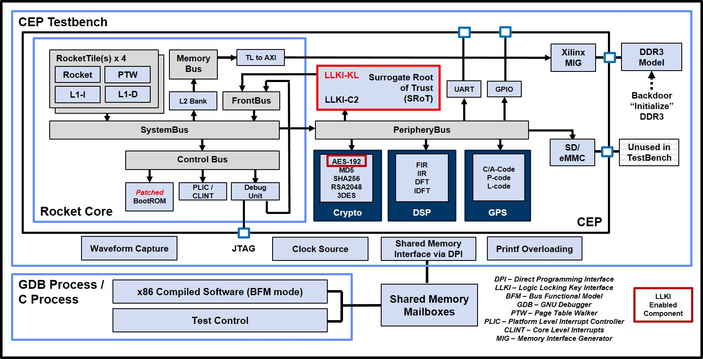

[//]: # (Copyright 2020 Massachusetts Institute of Technology)
[//]: # (SPDX short identifier: BSD-2-Clause)

[](https://zenodo.org/badge/latestdoi/108179132)
[](https://opensource.org/licenses/BSD-2-Clause)

<p align="center">
    
</p>
<p align="center">
    
</p>
<p align="center">
   Copyright 2020 Massachusetts Institute of Technology
</p>
<p align="center">
    
</p>

The Common Evaluation Platform (CEP) is intended as a surrogate System on a Chip (SoC) that provides users an open-source evaluation platform for the evaluation of custom tools and techniques.  An extensive verification environment provided to ensure the underlying functionality is maintained even after modification.

The Logic Locking Key Interface (LLKI) has been provided as a representative means of distributing key / configuration material to LLKI-enabled cores.  

For CEP v3.0, the Surrogate Root of Trust (SRoT) and LLKI-enabled AES-192 core has been added.  Example test vectors have been with additional LLKI information being available in the comments of files located in ./hdl_cores/llki.

<p align="center">
    
</p>

Additional information on the objectives of the CEP may be found in [./doc/CEP_SecEvalTargets.pdf](CEP_SecEvalTargets.pdf).

The CEP is based on the SiFive U500 Platform which leverages the UCB Rocket Chip.  Much of the design is described in Chisel (https://github.com/freechipsproject/chisel3), a domain specific extension to Scala tailored towards constructing hardware.  The output of the Chisel generators is synthesizable verilog.

Currently, the test platform for the CEP is the Xilinx VC-707 FPGA Development Board.  Longer term plans include migrating to other platforms with the eventual goal of taping out an ASIC.


## Additional Sources of Information
* Freedom U500 VC707 FPGA Dev Kit Getting Started Guide  - https://www.sifive.com/documentation
* Chisel Wiki                                            - https://github.com/freechipsproject/chisel3/wiki
* Chisel Bootcamp                                        - https://github.com/freechipsproject/chisel-bootcamp
* Chisel Cheatsheet                                      - https://chisel.eecs.berkeley.edu/2.2.0/chisel-cheatsheet.pdf
* Addition Chisel info from UCB                          - https://chisel.eecs.berkeley.edu/
* UCB Rocket Chip                                        - https://github.com/chipsalliance/rocket-chip
* Freedom U500 Repository                                - https://github.com/sifive/freedom
* Freedom Unleased Software Development Kit              - https://github.com/sifive/freedom-u-sdk


## Pre-requisites (validated test/build configuration):
The following items describe the configuration of the system that CEP has been developed and tested on:
* Ubuntu 16.04 LTS x86_64
* Modelsim Questa Sim-64 v2019.1 (for co-simulation and unit simulation)
* Xilinx Vivado 2018.3 (Design or System Edition)
  - Plus Digilent Adept Drivers for programming the VC-707, https://reference.digilentinc.com/reference/software/adept/start?redirect=1#software_downloads)
* Terminal emulator (such as `minicom`)
* bash

Other versions/combinations may work, but they have not been explicitly verified.


## Cloning the CEP Repository and Getting External Dependencies
Before proceeding, you'll need to install curl if it is not already installed on your system:

`sudo apt install curl`

After cloning the CEP repository from https://github.com/mit-ll/CEP, you will need get the external dependencies (respositories) that have not been included directly within the CEP repository (git submodules are not used).

First, run the following:
```sh
./get_external_dependencies.sh all
```

As noted by the script, many directories will be created/overwritten by this command.  Any local changes to these directories will be lost.  Additional usage info can be found by just running the script without any parameters.


## Setting up your environment

To build the CEP, several packages and toolsets must be installed and built.  Follow the steps listed below.


### Installing Vivado and Modelsim
It is assumed that Vivado and Modelsim are installed on your system.  The CEP has been tested on Vivado 2018.3 System Edition, albeit Design Edition should also work.  It is noted that some of the libraries pulled in after sourcing the environmental script (e.g., `/opt/Xilinx/Vivado/2018.3/settings64.sh`) can conflict with the RISC-V toolchain build process.  It is recommended that you not source this file in the bash shell you use to build the RISC-V tools.

Modelsim is required if you intend to run the co-simulation or unit-simulation environments located in `<CEP_ROOT>/cosim` and `<CEP_ROOT>/unit_simulation` respectively.  Version 2018.3 is recommended.  Other simulators or versions may work, but they have not been explicitly tested.


### Install the RISC-V GNU Toolchain
The RISC-V source code resides in <CEP_ROOT>/software/riscv-gnu-toolchain

Begin by installing the dependencies by executing the following:
`sudo apt install autoconf automake autotools-dev curl python3 libmpc-dev libmpfr-dev libgmp-dev gawk build-essential bison flex texinfo gperf libtool patchutils bc zlib1g-dev libexpat-dev`

Now, build the toolchain.  

Ensure you have write permissions to the directory pointed to by $RISCV and that the current shell has NOT sourced the Xilinx Vivado environment script:

    $ cd <CEP_ROOT>/software/riscv-gnu-toolchain
    $ ./configure --prefix=/opt/riscv
    $ make -jN                                   (Where N is the number of cores that can be devoted to the build)

Now with the tools installed, you'll want to add them to your path:
```
    $ export RISCV=/opt/riscv
    $ export PATH=$PATH:$RISCV/bin
```

### Install Scala
Next, you need to install Scala which is required by Chisel.

1. Install Java
  
    ```
    sudo apt install default-jdk
    ```

2. [Install sbt](http://www.scala-sbt.org/release/docs/Installing-sbt-on-Linux.html),
    which isn't available by default in the Ubuntu system package manager:
    ```
    echo "deb https://dl.bintray.com/sbt/debian /" | sudo tee -a /etc/apt/sources.list.d/sbt.list
    sudo apt-key adv --keyserver hkp://keyserver.ubuntu.com:80 --recv 642AC823
    sudo apt-get update
    sudo apt-get install sbt
    ```

### Install Feedom-U-SDK dependencies
Install the required dependencies by running the following command:
`sudo apt install build-essential git texinfo bison flex libgmp-dev libmpfr-dev libmpc-dev gawk libz-dev libssl-dev python unzip libncurses5-dev libglib2.0-dev libpixman-1-dev device-tree-compiler`


## Repository Directory Structure (highlight)
```
<CEP ROOT> ---|-- cosim/ - Defines the CEP co-simulation evironment for performing "chip" level 
              |            simulations of the CEP in either bare metal or bus functional model 
              |            (BFM) mode.  Dependent on the building of the CEP hardware (described
              |            below).  Refer to the README.md file in this directory for more information.
              |
              |-- unit_simulation/ - Unit-level testbenches for the CEP cores
              |
              |-- get_external_dependencies.sh - Script used to fetch external CEP dependencies.
              |
              |-- hdl_cores/ - Source for all the components within the CEP.  All the blocks that 
              |     |          implement algorithms also have corresponding test vectors.
              |     |
              |     |-- freedom - CEP-modified variant of the Freedom U500 platform
              |           |
              |           |-- mitllBlocks - Chisel code for the CEP cores
              |
              |-- generated_dsp_code/  - Placeholder for the generated DSP code that cannot be
              |                          directly included in the CEP repository due to licensing
              |                          restrictions.
              |
              |-- opentitan/	       - Copy of the OpenTitan repository, some components are used by the LLKI.
              |
              |-- software/        
                    |
                    |-- freedom-u-sdk/ - Directory containing an export of the https://github.com/
                    |                    mcd500/freedom-u-sdk directory, which is a fork of the 
                    |                    main SiFive repo.  Variant specifically chosen because it 
                    |                    has been modified to boot without PCIe support (which for 
                    |                    the VC-707 requires a HiTech Global HTG-FMC-PCIE module).
                    |
                    |-- riscv-gnu-toolchain/  - RISC-V GNU toolchain

```

### Note regarding endianess

As one might be aware: the endianess usage is not consistent thru out the design, expesially where Chisel wrappers are used to connect to various HW cores. For some cores, little endian is used for loading keys/plain text but big-endian is used to produce cipher text as output. This creates confusion and inconsistent as one might try to understand/follow SW driver for these cores. Also, please note, RISCV is little endian.

As of release CEP v2.4 and later, unless otherwise specify, big endian is used thru out the design to match key/plain/ciphertext network order.

This makes it consistent and easier to debug when key/plain text are printed to match against registers.

```
For example: As key/plain/ciphertext have the following network order format (big-endian, read left-to-right) :

    byte0 , byte1, byte2, byte3, .... byteN

They will be mapped to the design's registers as follows:
    
For 64-bit registers:
--------------------

                        63                                                             0
                       +-------+-------+-------+-------+-------+-------+-------+--------+           
   register Offset 0x0 | byte0 | byte1 | byte2 | byte3 | byte4 | byte5 | byte6 | byte7  |
                       +-------+-------+-------+-------+-------+-------+-------+--------+
   register offset 0x8 | byte8 |   ....                                        | byte15 |
                       +-------+-------+-------+-------+-------+-------+-------+--------+
                   ... | ....                                                           |

For 32-bit registers: (right-justify if maps to 64-bit offset)
--------------------    
                                                     31                            0
                                                        +-------+-------+-------+-------+
                                    register Offset 0x0 | byte0 | byte1 | byte2 | byte3 | 
                                                        +-------+-------+-------+-------+
                                    register offset 0x4 | byte4 |   ....        | byte7 |
                                                        +-------+-------+-------+-------+
                                                    ... | ....                          |
```

### Note regarding DSP cores
Due to licensing, the verilog source for the DFT and IDFT components are not included with the CEP repository.  Instructions for generating these cores can be found in the [./hdl_cores/dsp/README.md](./hdl_cores/dsp/README.md) file.  Scripts assume that the generated verilog has been placed in `<CEP_ROOT>/generated_dsp_code`.


## Building the CEP
Configure your VC-707 with the following DIP switch settings (SW11):

```
-----------------------
|         SW11        |
| --- --- --- --- --- |
| | | | | | | |*| | | |
| |*| |*| |*| | | |*| |
| --- --- --- --- --- |
|  1   2   3   4   5  |
|                     |
-----------------------
```

The following steps assume the aforementioned prerequisites have been installed and all external dependencies have been fetched.

There are two primary build steps for the CEP, the hardware and the software.


### Building the Hardware
Ensure that you have sourced the setup scripts for Xilinx Vivado 2018.3.

Example : `source /opt/Xilinx/Vivado/2018.3/settings64.sh`

Change to the `<CEP_ROOT>/hdl_cores/freedom` directory and execute the following commands:

```sh
$ make -f Makefile.vc707 verilog
$ make -f Makefile.vc707 mcs
```

Build time will vary based on the machine, but could be in the range of 1 to 2 hours.  The first step will create the Chisel-generated verilog with the second creating the bitfile for the VC-707.

Following the build process and assuming the [Digilent Adept 2 drivers](https://reference.digilentinc.com/reference/software/adept/start?redirect=1#software_downloads) have been installed, you can program a VC-707 attached via USB using the following script:

```sh
./program_card.sh
```


### Bulding CEP Diagnostics Software ###

Leveraging the CEP Diagnostics written for CEP co-simulatlion, run the following steps to install the diagnostics into the freedom-u-sdk linux build.

```sh
cd <CEP ROOT>/cosim
make build_v2c                    <-- Required: Generate C header files from Verilog needed by cep_diag
cd <CEP ROOT>/cosim/drivers/linux
make install append
```

If subsequent changes are made to the source code in <CEP_ROOT>/cosim/drivers/linux, simply copy the changes over to the Linux build by running `make install`.

Next, one needs to build linux.  First, change to the `<CEP ROOT>/software/freedom-u-sdk` directory.  Ensure that the linux variant of the RISC-V toolset is used by executing `unset RISCV`

Begin the build by running `make -jN BOARD=vc707devkit_nopci all` where N is the numbers of cores you can dedicate to the build.  Ensure that you have NOT sourced the Xilinx Vivado environment setup script before running this step.

Following the linux build, which can take 30 - 60 minutes, you will have a binary which you can load onto an SD card.

The SD card can be loaded by executing `sudo make DISK=/dev/<your SD card> vc707-sd-write` where you need to know what device your SD card is mapped to.

Before booting the CEP, you'll want to connect to the VC-707's UART (via USB).  This device is typically mapped to `/dev/ttyUSBN` when N can be 0, 1, or 2.  Check you `/dev/` directory following connecting the UART to see which device enumerates.

Install the newly programmed SD card into the VC-707.

You'll then want to connect via a terminal program with the following parameters: `115200 baud, 8N1, no flow control`

You should see the following logo/text appear:

```                                                                
          ::::::::::::::/+   `....-----------:/-     ....-:::::::/+
       ...o+++++++++++++o:  :/--:-/++o+++o+++/-`   ..  `..++++++++:
       -o++o++///////++++o:  +o++o`/...........    +:::/. .:::::o++:
       -++++--       :+++o: `oo++o`/.........:/   `o+++o`:    -+++o:
       -++++--       -:::/. +o+++o`/++o+++o+o-:   `o+++/.-....++o:-
       -++++--              +oo++o.://///////-`   `o+o+o+++o++o+o:.
       -++++--      `.....  +oooo-/               `o+ooo//:/::::/-
       -o+++-:.....:/::::/  +oo+o :`````````````  `s+++s`-
       -++++-::::::/++/++:  ++++o//////////////:- `o+++o`-
       ./+++++++++++oo+++:  +oo++o++++o+o+oo+oo.- `s+++s`-
       .--:---:-:-::-::`  -::::::::::::::::::.   :::::.

                      Common Evaluation Platform v3.0
         Copyright (C) 2020 Massachusetts Institute of Technology

            Built upon the SiFive Freedom U500 Platform using
             the UCB Rocket Chip targeting the Xilinx VC-707

...

LOADING /
```

The CEP will then begin booting linux assuming your SD card has been properly built as described above. 


## Using the CEP

Following the linux boot, you should be presented with a login prompt.  Credentials are the same as the freedom-u-sdk defaults, username: `root` and password `sifive`.

At the command prompt, you can run the CEP diagnostics by commanding `cep_diag`.

A partial output should be similar to:

```sh
*** CEP Tag=CEPTest CEP HW VERSION = v3.00 was built on Sep 17 2020 12:01:26 ***
 CEP FPGA Physical=0x70000000 -> Virtual=0x00000020004fa000
gSkipInit=0/0
gverbose=0/0
Setting terminal to VT102 with erase=^H
EnterCmd> menu
        ============== TEST MENU ==============
    0 : runAll               : Run all available tests
    1 : cepLockTest          : Run CEP single lock test on all cores
    2 : cepMultiLock         : Run CEP multi-lock test on all cores
    3 : cepRegTest           : Run CEP register tests on all cores
    4 : cep_AES              : CEP AES test
    5 : cep_DES3             : CEP DES3 test
    6 : cep_DFT              : CEP DFT test
    7 : cep_FIR              : CEP FIR test
    8 : cep_GPS              : CEP GPS test
    9 : cep_IDFT             : CEP IDFT test
   10 : cep_IIR              : CEP IIR test
   11 : cep_MD5              : CEP MD5 test
   12 : cep_RSA              : CEP RSA test
   13 : cep_SHA256           : CEP SHA256 test
   14 : ddr3Test             : main Memory Test on all cores
   15 : cepAllMacros         : CEP all macros test (single thread)
   16 : cepMacroMix          : CEP Macro tests (aes/des3/md5/sha)
   17 : cepThrTest           : Run multi-thread tests on all cores
   18 : cacheFlush           : I+D-caches flush all cores (via self-mod-code)
   19 : dcacheCoherency      : D-cache coherency Test on all cores
   20 : icacheCoherency      : I-cache coherency Test on all cores
<...>
```

You should now have a functioning CEP!


## CEP Cores
The Freedom U500 platform has been extended to include several accelerator cores as depicted in the above block diagram.  Included with these cores are independately generate test vectors with a focus on increased coverage (see co-simulation and unit-simulation sections below)

The following cores have been integrated into the "standard" CEP build:
- AES-192
- Triple-DES
- MD5
- SHA-256
- RSA
- Discrete Fourier Transform
- Inverse Discrete Fourier Transform
- Finite Impulse Response
- Infinite Impulse Response
- GPS code generator

Beginning with the v2.4 release, the following "generated" cores have been added to the repository, but are currently not integrated into the CEP build.
- A(EE)ES-WB : Advanced Egregiously Extended Encryption Standard - Whitebox Edition [./hdl_cores/aeees/README.md](./hdl_cores/aeees/README.md).
- (RI)IIR : Randomly Indeterminate Infinite Impulse Response [./hdl_cores/auto-fir/README.md](./hdl_cores/auto-fir/README.md).

 
## Co-Simulation
The primary documentation source for the CEP co-simulation environment can be found in [./cosim/README.md](./cosim/README.md).

It is worth highlighting that simulation is dependent on completing the `Building the Hardware` steps above.

The environment supports writing tests that can run in simulation or on the hardware itself.


## Unit Simulation
The unit simulation testbenches allow for simulation of indivdual CEP cores without incurring the overhead of simulating
the entire CEP (RISC-V, DDR, etc.)

More information about the unit simulations can be found [./unit_simulation/README.md](./unit_simulation/README.md).


## Feedback
Feedback on the CEP is welcomed by the authors.  They are best contacted by opening a Github issue.


## Release Notes

v1.0 - Initial release

v1.1 - (19 July 2018)
* Directory structure has been reorganized (details below)
* Upgraded to the non-deprecated mor1kx (added as a subnodule)
* Verified with both the pre-built and build-your-own version of the Newlib toolchain as described on [http://openrisc.io](http://openrisc.io)
* In addition to test vectors for each of the cores, some additional test_software, such as "hello world", have been added for reference
* Expanded testbench (details below)
* Bug fixes and general code cleanup [Additional details in the git commit history]

v1.1.1 - (27 September 2018)
* Added CEP\_utilization\_placed.rpt in implSummaries directory.  This summarizes utlization of the CEP v1.1 targetted to the VC707 using Vivado 2018.1.

v1.2 - (15 November 2018)
* Major Update: The underlying bus has been converted from Wishbone-B4 to AXI4-Lite.  All cores as well as the MOR1KX has been wrapped with translation modules.  All the wrapping logic and interconnect are now in SystemVerilog.
* Regression Suite: In additon to each core's unit tests, a regression test suite has been included.  When compiled by the or1k toolchain, it be loaded/synthesized into the CEP RAM block and run at boot time.
* Modelsim Testing: Unit-level and system-level modelsim-based testbenches added
* GPS clkgen: The GPS clock gen component has been moved to the top level of the CEP, simplifying its replacement when targetting an ASIC.
* Misc. bug fixes

v2.0 - (16 August 2019)
* Major Update: mor1k proceesor core replaced with the UCB Rocket-Chip within the SiFive Freedom U500 Platform.  All modules have been updated to support TileLink natively.  Currently only the AES and FIR cores have been integrated, but v2.1 will include the re-release of all the CEP cores.   

v2.1 - (31 October 2019)
* Integrated DES3, GPS, MD5, RSA, SHA256, DFT, IDFT, and IIR cores.

v2.2 - (31 January 2020)
* Added co-simulation environment that supports both Bus Functional Model (BFM) and Baremetal simulation modes.  Additional diagnostic capabilities within Linux.

v2.3 - (17 April 2020)
* Added unit-level testbenches for all CEP cores.  Co-simulation modified to generate unit-level test stimulus.  

v2.4 - (5 June 2020)
* CEP core test coverage expanded
* Unit testbenches transactional-level support added
* AES-derived and FIR-derived generated cores added
* Misc. bug fixes

v2.5 - (31 July 2020)
* All Unit-level testbenches have been expanded to optional support the Logic Locking Keying Interface (LLKI)
  for both cycle-level and transactional-level modes

v2.51 - (7 August 2020)
* Legacy unused core wrapper files (axi4lite and wb) removed

v2.52 - (2 September 2020)
* Added ./doc/CEP_TestDescriptions.pdf

v2.6 - (18 September 2020)
* Rocket-Chip and Freedom repositories updated.  Source responsitory list:
    https://github.com/sifive/freedom/tree/8622a684e7e54d0a20df90659285b9c587772629              - Aug 19, 2020
    https://github.com/chipsalliance/rocket-chip/tree/d2210f9545903fad40c9860389cdcf9c28515dba   - Apr  2, 2020
    https://github.com/sifive/fpga-shells/tree/19d0818deda5d295154992bd4e2c490b7c905df9          - Jan 28, 2020
    https://github.com/sifive/sifive-blocks/tree/12bdbe50636b6c57c8dc997e483787fdb5ee540b        - Dec 17, 2019
    https://github.com/mcd500/freedom-u-sdk/tree/29fe529f8dd8e1974fe1743184b3e13ebb2a21dc        - Apr 12, 2019
* riscv-tools (formerly under rocket-chip) now located in ./software/riscv-gnu-toolchain
* KNOWN ISSUES:
	- The iCacheCoherency passes when running bare-metal simulation, but fails when running on the VC-707.  There is an issue with
	  the iCache protocol that the tight-looped iCache coherency test results in one or more of the Rocket Cores (there are 4 in 
	  the CEP) L1 iCache not getting the value associated with the most recent write to instruction memory.

	  Functionally, this should only cause an issue when dealing with self-modifying code, which is an atypical coding practice.

v2.61 - (2 October 2020)
  - Added initial simulation support for Cadence XCellium
  - Cosim: Expanded DDR3 memory size to support "larger" bare-metal executables created by the new RISCV toolchain released with v2.6

v2.7 - (28 October 2020)
* Added support for RISC-V ISA tests (under ./cosim/isaTests)
* Updated license statements to BSD-2-Clause
* KNOWN ISSUES:
  - The iCacheCoherency passes when running bare-metal simulation, but fails when running on the VC-707.  There is an issue with
    the iCache protocol that the tight-looped iCache coherency test results in one or more of the Rocket Cores (there are 4 in 
    the CEP) L1 iCache not getting the value associated with the most recent write to instruction memory.

    Functionally, this should only cause an issue when dealing with self-modifying code, which is an atypical coding practice.

  - The following cosim tests fail when run under RHEL using the "new" RISC-V toolchain:
    - bareMetalTests/cacheCoherence
    - isaTests/rv64mi-p-access 
    - isaTests/rv64ud-p-ldst

v2.71 - (2 November 2020)
* Corrected README.md issue

v3.0 - (18 December 2020)
* Initial LLKI release with Surrogate Root of Trust
* AES core replaced with LLKI-enabled AES core, all other cores remain unchanged

## Licensing
The CEP been developed with a goal of using components with non-viral, open source licensing whenever possible.  When not feasible (such as Linux), pointers to reference repositories are given using the [get_external_dependencies.sh](./get_external_dependencies.sh) script.  

Additional licensing information can be found in the [LICENSE](./LICENSE) and [licenseLog.txt](./licenseLog.txt) files.


## DISTRIBUTION STATEMENT A. Approved for public release: distribution unlimited.

© 2020 MASSACHUSETTS INSTITUTE OF TECHNOLOGY

Subject to FAR 52.227-11 – Patent Rights – Ownership by the Contractor (May 2014)
SPDX-License-Identifier: BSD-2-Clause

This material is based upon work supported by the Name of Sponsor under Air Force Contract No. FA8721-05-C-0002 and/or FA8702-15-D-0001. Any opinions, findings, conclusions or recommendations expressed in this material are those of the author(s) and do not necessarily reflect the views of the Name of Sponsor.

The software/firmware is provided to you on an As-Is basis
