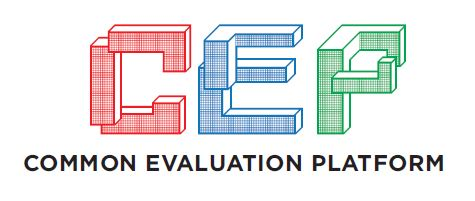

<p align="center">
    
</p>
<p align="center">
   v2.1
   <br>
   Copyright 2019 Massachusetts Institute of Technology
</p>

<br>

The Common Evaluation Platform (CEP) is intended as a surrogate System on a Chip (SoC) allowing users to test a variety of tools and techniques.  Test vectors are provided to ensure the underlying functionality is maintained even after modification.

Additional information on the objectives of the CEP may be found in [./CEP_SecEvalTargets.pdf](CEP_SecEvalTargets.pdf).

CEP v2.1 has been based on the SiFive U500 Platform which leverages the UCB Rocket Chip.  Much of the design is described in Chisel (https://github.com/freechipsproject/chisel3), a domain specific extension to Scala tailored towards constructing hardware.  The output of the Chisel generators is synthesizable verilog.

Currently, the test platform for the CEP is the Xilinx VC-707 FPGA Development Board.  Longer term plans include migrating to other platforms with the eventual goal of taping out an ASIC.

## Additional Sources of Information
* Freedom U500 VC707 FPGA Dev Kit Getting Started Guide  - https://www.sifive.com/documentation
* Chisel Wiki                                            - https://github.com/freechipsproject/chisel3/wiki
* Chisel Bootcamp                                        - https://github.com/freechipsproject/chisel-bootcamp
* Chisel Cheatsheet                                      - https://chisel.eecs.berkeley.edu/2.2.0/chisel-cheatsheet.pdf
* Addition Chisel info from UCB                          - https://chisel.eecs.berkeley.edu/
* UCB Rocket Chip                                        - https://github.com/chipsalliance/rocket-chip
* Freedom U500 Repository                                - https://github.com/sifive/freedom
* Freedom Unleased Software Development Kit              - https://github.com/sifive/freedom-u-sdk


## Pre-requisites (validated test/build configuration):
The following items describe the configuration of the system that CEP v2.1 has been developed and tested on:
* Ubuntu 16.04 LTS x86_64
* Modelsim Questa Sim-64 v10.6c (for unit-level simulation)
* Xilinx Vivado 2018.3 (Design or System Edition)
  - Plus Digilent Adept Drivers for programming the VC-707, https://reference.digilentinc.com/reference/software/adept/start?redirect=1#software_downloads)
* Terminal emulator (such as `minicom`)
* bash

## Cloning the CEP Repository and Getting External Dependencies
Before proceeding, you'll need to install curl if it is not already installed on your system:

`sudo apt install curl`

After cloning the CEP repository from https://github.com/mit-ll/CEP, you will need get the external dependencies (respositories) that have not been included directly within the CEP repository.

First, run the following:
```sh
./get_external_dependencies.sh all
```

As noted by the script, many directories will be created/overwritten by this command.  Any local changes to these directories will be lost.  The script also provides to option of 
appending these directories to the `.gitignore` file.  Additional usage info can be found by just running the script without any parameters.

## Setting up your environment

To build the CEP, several packages and toolsets must be installed and built.  Follow the steps listed below.

### Installing Vivado and Modelsim
It is assumed that Vivado and Modelsim are installed on your system.  The CEP has been tested on Vivado 2018.3 System Edition, albeit Design Edition should also work.  It is noted that some of the libraties pulled in after sourcing the environmental script (e.g., `/opt/Xilinx/Vivado/2018.3/settings64.sh`) can conflict with the RISC-V toolchain build process.  It is recommended that you not `source` this file in the bash shell you use to build the RISC-V tools.

Modelsim is only required if you intend to run the unit-level simulations on the CEP cores located in `<CEP_ROOT>/simulation`.  Other simulators may work, but they have not been explicitly tested.

### Install the RISC-V toolchain
The RISC-V source code resides in <CEP_ROOT>/hdl_cores/freedom/rocket-chip/riscv-tools.

Begin by installing the RISC-V tools package dependencies by executing the following:
`sudo apt install autoconf automake autotools-dev curl device-tree-compiler libmpc-dev libmpfr-dev libgmp-dev gawk build-essential bison flex texinfo gperf libtool patchutils bc zlib1g-dev libexpat1-dev pkg-config`

Once that is complete, the RISC-V toolset needs to be built.  The RISCV environment variable should be set to the
desired installation directory.  For example (assuming bash):

    $ export RISCV=/opt/riscv

Now, build the RISCV tools.  Ensure you have write permissions to the directory pointed to by $RISCV and that the 
current shell has NOT sourced the Xilinx Vivado environment script:

    $ cd <CEP_ROOT>/hdl_cores/freedom/rocket-chip/riscv-tools
    $ export MAKEFLAGS="$MAKEFLAGS -jN" # Assuming you have N cores on your host system
    $ ./build.sh

You'll also need to build the linux cross-compiler.  This allows test compiles of the CEP Regression Suite (or other applications) before building the Linux image.

```
    cd ./riscv-gnu-toolchain
    ./configure --prefix=$RISCV
    make linux
```

Now with the tools installed, you'll want to add them to your path:

`export PATH=$PATH:$RISCV/bin`

### Install Scala
Next, you need to install Scala which is required by Chisel.

1. Install Java
  
    ```
    sudo apt install default-jdk
    ```

2. [Install sbt](http://www.scala-sbt.org/release/docs/Installing-sbt-on-Linux.html),
    which isn't available by default in the system package manager:
    ```
    echo "deb https://dl.bintray.com/sbt/debian /" | sudo tee -a /etc/apt/sources.list.d/sbt.list
    sudo apt-key adv --keyserver hkp://keyserver.ubuntu.com:80 --recv 642AC823
    sudo apt-get update
    sudo apt-get install sbt
    ```

### Install Feedom-U-SDK dependencies
Install the required dependencies by running the following command:
`sudo apt install build-essential git texinfo bison flex libgmp-dev libmpfr-dev libmpc-dev gawk libz-dev libssl-dev python unzip libncurses5-dev libglib2.0-dev libpixman-1-dev device-tree-compiler`

## Repository Directory Structure (highlight)
```
<CEP ROOT> ---|-- get_external_dependencies.sh - Script used to fetch external CEP dependencies.
              |
              |-- hdl_cores/ - Source for all the components within the CEP.  All the blocks that implement algorithms also have corresponding test vectors.
              |     |
              |     |-- freedom - CEP-modified variant of the Freedom U500 platform
              |           |
              |           |-- mitllBlocks - Chisel code for the CEP cores
              |
              |-- generated_dsp_code/  - Placeholder for the generated DSP code
              |
              |-- simulation/ - Modelsim Testbenches and associated files
              |     |
              |     |-- run_regression.sh - Shell script to run unit tests for all CEP cores.
              |     |
              |     |-- run_sim_<xxx>.do - Modelsim TCL script for running individual core tests or for the entire CEP.
              |     |
              |     |-- waves_<xxx>.do - Modelsim TCL script for adding an initial set of waveforms for the particular test.  The <xxx> should correspond to the run_sim_<xxx>.do script.
              |     |
              |     | -- testbench/ - Testbench source files
              |
              |-- software/
              |
              |-- freedom-u-sdk/ - Directory containing an export of the https://github.com/mcd500/freedom-u-sdk directory, which is a fork of the main SiFive repo.  Variant specifically chosen
              |                    because it has been modified to boot without PCIe support (which for the VC-707 requires a HiTech Global HTG-FMC-PCIE module).
              |
              |-- test_software/ - Test software for the CEP cores.  Designed to run withing the Linux environment.

```

## Note regarding DSP cores
Due to licensing, the generated source code for the DFT, IDFT, IIR, and IIR components are not included with the CEP repository.  Instructions for generating these cores can be found in the [./hdl_cores/dsp/README.md](./hdl_cores/dsp/README.md) file.  Scripts assume that the DSP generated code has been placed in `<CEP_ROOT>/generated_dsp_code`.

## Building the CEP
Configure your VC-707 with the following DIP switch settings (SW11):

```
-----------------------
|         SW11        |
| --- --- --- --- --- |
| | | | | | | |*| | | |
| |*| |*| |*| | | |*| |
| --- --- --- --- --- |
|  1   2   3   4   5  |
|                     |
-----------------------
```

These steps assume prerequisites have been installed and all external dependencies have been fetched.

There are two primary build steps for CEP v2.1, the hardware and the software.

## Building the Hardware
Ensure that you have sourced the setup scripts for Xilinx Vivado 2018.3.

Example : `source /opt/Xilinx/Vivado/2018.3/settings64.sh`

Change to the `<CEP_ROOT>/hdl_cores/freedom` directory and execute the following commands:

```sh
$ make -f Makefile.vc707-u500devkit verilog
$ make -f Makefile.vc707-u500devkit mcs
```

Build time will vary based on the machine, but could be the range of 1 to 2 hours.  The first step will create the Chisel-generated verilog with the second creating the bitfile for the VC-707.

Following the build process and assuming the Digilent Adept 2 drivers have been installed, you can program a VC-707 attached via USB using the following script:

```sh
./program_card.sh
```

## Build the Software
Next, one should change to the `<CEP ROOT>/software/test_software/regression` directory.  This contains the regression test suite for the CEP.

The application needs to be added to the freedom-u-sdk directory before building linux.  While in this directory, execute the following command:

```sh
make install append
```

This will copy the application to a newly created package directory within the  `<CEP ROOT>/software/freedom-u-sdk/buildroot/package` directory.  In addition, it will modify the appropriate configuration files to ensure the application is included within the build.

Next, one needs to build linux.  First, change to the `<CEP ROOT>/software/freedom-u-sdk` directory.  Ensure that the linux variant of the RISC-V toolset is used by executing `unset RISCV`

Begin the build by running `make -jN BOARD=vc707devkit_nopci all` where N is the numbers of cores you can dedicate to the build.

Following the linux build, which can take 30 - 60 minutes, you will have a binary which you can load onto an SD card.

The SD card can be loaded by executing `sudo make DISK=/dev/<your SD card> vc707-sd-write` where you need to know what device your SD card is mapped to.

Before booting the CEP, you'll want to connect to the VC-707's UART (via USB).  This device is typically mapped to `/dev/ttyUSBN` when N can be 0, 1, or 2.  Check you `/dev/` directory following connecting the UART to see which device enumerates.

Install the newly programmed SD card into the VC-707.

You'll then want to connect via a terminal program with the following parameters: `115200 baud, 8N1, no flow control`

You should see the following logo/text appear:

```
   ::::::::::::::/+   `....-----------:/-     ....-:::::::/+  
...o+++++++++++++o:  :/--:-/++o+++o+++/-`   ..  `..++++++++:  
-o++o++///////++++o:  +o++o`/...........    +:::/. .:::::o++: 
-++++--       :+++o: `oo++o`/.........:/   `o+++o`:    -+++o: 
-++++--       -:::/. +o+++o`/++o+++o+o-:   `o+++/.-....++o:-  
-++++--              +oo++o.://///////-`   `o+o+o+++o++o+o:.  
-++++--      `.....  +oooo-/               `o+ooo//:/::::/-   
-o+++-:.....:/::::/  +oo+o :`````````````  `s+++s`-           
-++++-::::::/++/++:  ++++o//////////////:- `o+++o`-           
./+++++++++++oo+++:  +oo++o++++o+o+oo+oo.- `s+++s`-           
  .--:---:-:-::-::`  -::::::::::::::::::.   :::::.            
                                                              
            Common Evaluation Platform v2.1                   
   Copyright 2019 Massachusetts Institute of Technology       
                                                              
     Built upon the SiFive Freedom U500 Platform using        
                   the UCB Rocket Chip  
```

The CEP will then begin load the bootimage from the SD card and booting linux.

## Using the CEP

Following the linux boot, you should be presented with a login prompt.  Credentials are the same as the freedom-u-sdk defaults, username: `root` and password `sifive`.

At the command prompt, you can run the CEP Regression suite by commanding `cepregression`.  

A partial output should be similar to:

```
****************************************************************                                                                                                                                 
*    Common Evaluation Platform (v02.10) Regression Suite      *                                                                                                                                 
****************************************************************                                                                                                                                 
                                                                                                                                                                                                 
Initializing CEP Cores                                                                                                                                                                           
AES              @ 0x70000000                                                                                                                                                                    
MD5              @ 0x70010000                                                                                                                                                                    
SHA256           @ 0x70020000                                                                                                                                                                    
RSA              @ 0x70030000                                                                                                                                                                    
DES3             @ 0x70040000                                                                                                                                                                    
DFT              @ 0x70050000                                                                                                                                                                    
IDFT             @ 0x70060000                                                                                                                                                                    
FIR              @ 0x70070000                                                                                                                                                                    
IIR              @ 0x70080000                                                                                                                                                                    
GPS              @ 0x70090000                                                                                                                                                                    
CEP Version      @ 0x700f0000                                                                                                                                                                    
                                                                                                                                                                                                 
AES: *********************************************************                                                                                                                                   
AES: * AES test started ...                                  *                                                                                                                                   
AES: *********************************************************                                                                                                                                   
                                                                                                                                                                                                 
AES: Plaintext:         0x3243F6A8885A308D313198A2E0370734                                                                                                                                       
AES: Key:               0x2B7E151628AED2A6ABF7158809CF4F3C2B7E151628AED2A6                                                                                                                       
AES: Ciphertext:        0x4fcb8db85784a2c1bb77db7ede3217ac                                                                                                                                       
AES: PASSED:            test 1                                                                                                                                                                   
AES: Plaintext:         0x00112233445566778899AABBCCDDEEFF                                                                                                                                       
AES: Key:               0x000102030405060708090A0B0C0D0E0F0001020304050607                                                                                                                       
AES: Ciphertext:        0x65d50128b115a7780981475a6bd64a0e                                                                                                                                       
AES: PASSED:            test 2                                         

```

You should now have a functioning CEP!

## CEP Core simulation using Modelsim (optional)
Unit-level modelsim scripts and testbenches have been provided for the CEP acclerator cores in the `<CEP_ROOT>/simulation` directory.

Edit `run_sim_<XXX>.do`.... change the **DESIGN_ROOT** and **GENERATED_DSP_ROOT** variables to point to checkedout CEP repo and generated DSP files accordingly.

Once the desired program has been "loaded" into memory as described above, simulation is accomplished by running modelsim using following command in the `<CEP_ROOT>/simulation` directory:
    `vsim -do run_sim_<XXX>.do`

Alternatively, a non-gui simulation can be run by simply adding the -c switch:
    `vsim -c -do run_sim_<XXX>.do`

## Release Notes:

v1.0 - Initial release

v1.1 - (19 July 2018)
* Directory structure has been reorganized (details below)
* Upgraded to the non-deprecated mor1kx (added as a subnodule)
* Verified with both the pre-built and build-your-own version of the Newlib toolchain as described on [http://openrisc.io](http://openrisc.io)
* In addition to test vectors for each of the cores, some additional test_software, such as "hello world", have been added for reference
* Expanded testbench (details below)
* Bug fixes and general code cleanup [Additional details in the git commit history]

v1.1.1 - (27 September 2018)
* Added CEP\_utilization\_placed.rpt in implSummaries directory.  This summarizes utlization of the CEP v1.1 targetted to the VC707 using Vivado 2018.1.

v1.2 - (15 November 2018)
* Major Update: The underlying bus has been converted from Wishbone-B4 to AXI4-Lite.  All cores as well as the MOR1KX has been wrapped with translation modules.  All the wrapping logic and interconnect are now in SystemVerilog.
* Regression Suite: In additon to each core's unit tests, a regression test suite has been included.  When compiled by the or1k toolchain, it be loaded/synthesized into the CEP RAM block and run at boot time.
* Modelsim Testing: Unit-level and system-level modelsim-based testbenches added
* GPS clkgen: The GPS clock gen component has been moved to the top level of the CEP, simplifying its replacement when targetting an ASIC.
* Misc. bug fixes

v2.0 - (16 August 2019)
* Major Update: mor1k proceesor core replaced with the UCB Rocket-Chip within the SiFive Freedom U500 Platform.  All modules have been updated to support TileLink natively.  Currently only the AES and FIR cores have been integrated, but v2.1 will include the re-release of all the CEP cores.   

v2.1 - (31 October 2019)
* Integrated DES3, GPS, MD5, RSA, SHA256, DFT, IDFT, and IIR cores.

## Licensing
The CEP been developed with a goal of using components with non-viral, open source licensing whenever possible.  When not feasible (such as Linux), pointers to reference repositories are given using the [get_external_dependencies.sh](./get_external_dependencies.sh) script.  

Additional licensing information can be found in the [LICENSE](./LICENSE) and [licenseLog.txt](./licenseLog.txt) files.

## DISTRIBUTION STATEMENT A. Approved for public release: distribution unlimited.

This material is based upon work supported by the Assistant Secretary of Defense for Research and Engineering under Air Force Contract No. FA8721-05-C-0002 and/or FA8702-15-D-0001. Any opinions, findings, conclusions or recommendations expressed in this material are those of the author(s) and do not necessarily reflect the views of the Assistant Secretary of Defense for Research and Engineering.

© 2019 Massachusetts Institute of Technology.

The software/firmware is provided to you on an As-Is basis.

Delivered to the U.S. Government with Unlimited Rights, as defined in DFARS Part 252.227-7013 or 7014 (Feb 2014). Notwithstanding any copyright notice, U.S. Government rights in this work are defined by DFARS 252.227-7013 or DFARS 252.227-7014 as detailed above. Use of this work other than as specifically authorized by the U.S. Government may violate any copyrights that exist in this work.
