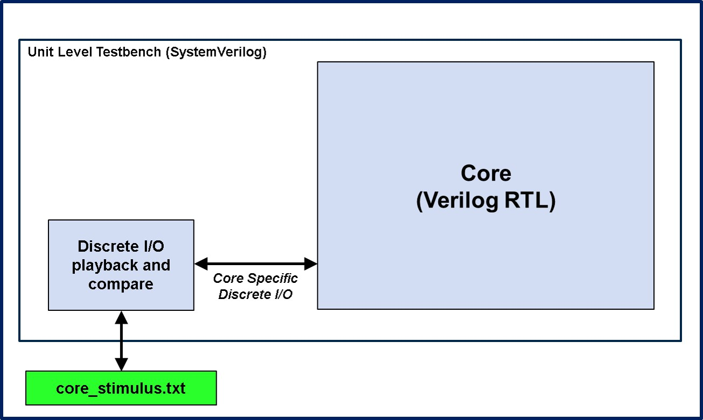
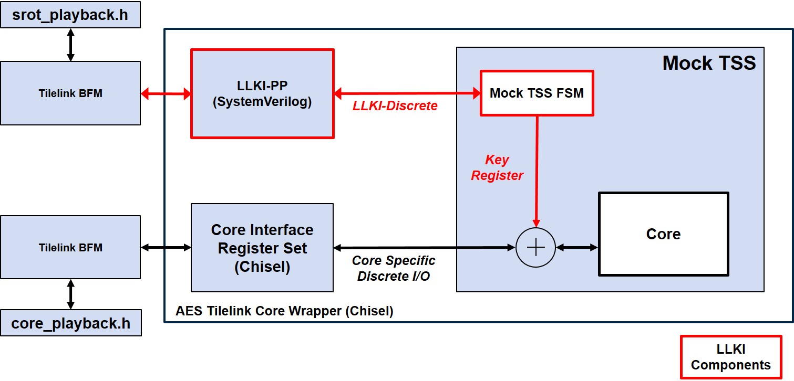

[//]: # (Copyright 2020 Massachusetts Institute of Technology)

<p align="center">
   Copyright 2020 Massachusetts Institute of Technology
</p>

## Unit Simulation README

<p align="center">
	<b>CEP Unit Testbench - Cycle Level</b>
</p>
<p align="center">
    
</p>

<p align="center">
	<b>CEP Unit Testbench - Transactional Level</b>
</p>
<p align="center">
    
</p>

This directory contains everything to support 2 different unit-level simulations:

1. Individual cycle-accurate unit testbenches where stimulus are applied at the core's IOs and core's output are checked every cycle. The testbench for each core simulation is individually tailored and the DUT is the HW core's RTL. See **[core]_sim/README.md** on how to run.

2. Individual transaction-level-accurate unit testbench where tilelink read/write commands are used. Under this enviroment, the DUT is the tilelink module that wraps the core's RTL. This tileLink module is extracted from the chip level netlist. See **TL_level_sim/README.md** for details.

User has options to run individual simulation by **cd-ing** to the appropriate directory and type **make** there.
Or to run all simulations (cycle-accurate as well as transaction-accurate)  by,  type **make** here.

## Pre-Requisites ##

Any Modelsim or Questa version installed that supports SystemVerilog and Verilog.

## Preprare Stimulus for simulation ##

If there is any change in stimulus for both modes, user needs to run the below commands to get all vectors updated:

```
make vectors
```

## To Run all cores simulation ##

```
make 

```

**NOTE**: Each core will have its own log file captured in <core>.log and wave file <core>.wlf, respectively.


#### Return to the root CEP [README](../README.md)
