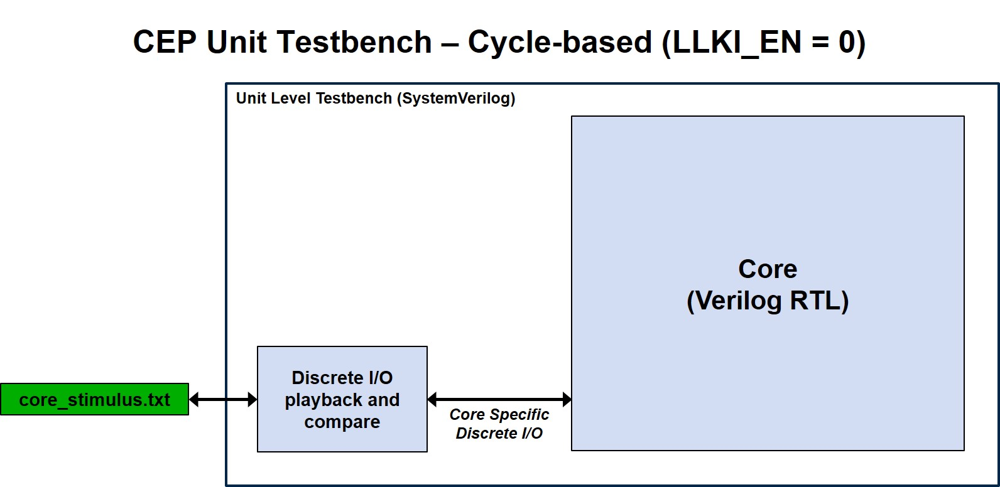
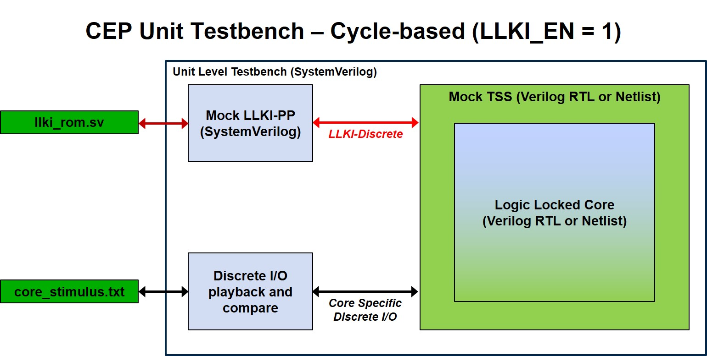
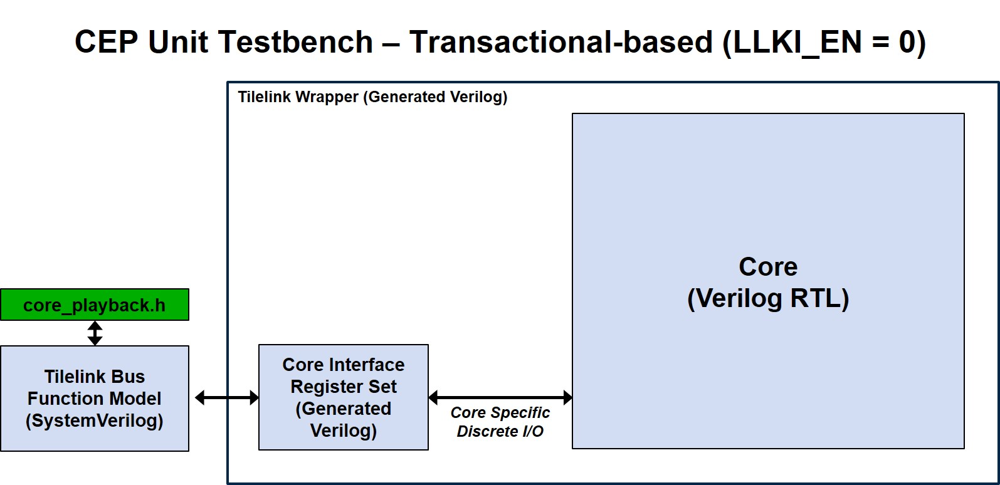
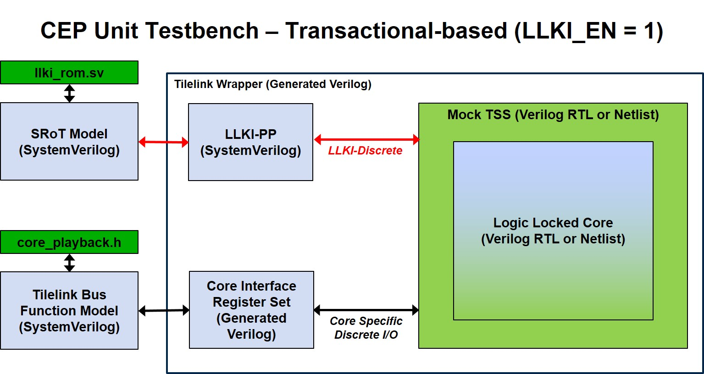

[//]: # (Copyright 2021 Massachusetts Institute of Technology)

<p align="center">
   Copyright 2021 Massachusetts Institute of Technology
</p>

## Unit Simulation README

<p align="center">
    
</p>

<p align="center">
    
</p>

<p align="center">
    
</p>

<p align="center">
    
</p>

This directory contains everything to support 2 different unit-level simulations:

1. Individual cycle-level unit testbenches where stimulus are applied at the core's IOs and core's output are checked every cycle. The testbench for each core simulation is individually tailored and the DUT is the HW core's RTL. See **[core]_sim/README.md** on how to run.

2. Individual transaction-level unit testbenches where tilelink read/write commands are used. Under this enviroment, the DUT is the tilelink module that wraps the core's RTL. This tileLink module is extracted from the chip level netlist. See **TL_level_sim/README.md** for details.

The user has the option to run an ndividual simulation by changing to the appropriate directory and executing the `make` command.
Or to run all simulations (cycle-accurate as well as transaction-accurate) by executing `make` in the current directory.

**NOTE**: As of CEP version 2.5 or later, LLKI (Logic Locking Key Interface) support is enabled by default (LLKI_EN=1). See above block diagrams. It can be turned off by specifying LLKI_EN=0 at the make command line (e.g, `make LLKI_EN=0`)

## LLKI packet format (Transaction-level testbenches) ##

Regarding the LLKI, to unlock or lock the core's logic, commands are formed and sent over TileLink bus as UDP packets. The UDP payload, in turn, contains the specific command to instruct the target to perform. As of current writing, only one command can be sent at a time.  The packet size is always aligned to multiple of 64-bits (TileLink bus size)

The LLKI packet format as follows:

```
   63            48 47             32 31            16 15             0
  +----------------+-----------------+----------------+----------------+ 
  |   sourcePort   | destinationPort |    Length      | Checksum       | UDP Header
  +---------+------+-----------------+----------------+----------------+ -------
  | LLKICmd | Size |                   LLKI_Attribute                  |    ^
  +---------+------+---------------------------------------------------+    |
  |                       LLKI_Key[0]  (MSB-word)                      | UDP Payload
  +---------+------+---------------------------------------------------+    |
  |                             LLKI_Key[1]                            |    | 
  +---------+------+---------------------------------------------------+    |
  |                       LLKI_Key[n]  (LSB-word)                      |    V
  +---------+------+---------------------------------------------------+ -------
```

UDP Header
==========

(cut/paste from wikipedia)

**sourcePort**: Source port number
This field identifies the sender's port, when used, and should be assumed to be the port to reply to if needed. If not used, it should be zero. If the source host is the client, the port number is likely to be an ephemeral port number. If the source host is the server, the port number is likely to be a well-known port number.

**destinationPort**: Destination port number
This field identifies the receiver's port and is required. Similar to source port number, if the client is the destination host then the port number will likely be an ephemeral port number and if the destination host is the server then the port number will likely be a well-known port number.

**Length** :
This field specifies the length in bytes of the UDP header and UDP data. The minimum length is 8 bytes, the length of the header. The field size sets a theoretical limit of 65,535 bytes (8 byte header + 65,527 bytes of data) for a UDP datagram. However the actual limit for the data length, which is imposed by the underlying IPv4 protocol, is 65,507 bytes (65,535   8 byte UDP header   20 byte IP header).
Using IPv6 jumbograms it is possible to have UDP datagrams of size greater than 65,535 bytes.[5] RFC 2675 specifies that the length field is set to zero if the length of the UDP header plus UDP data is greater than 65,535.

**Checksum** :
The checksum field may be used for error-checking of the header and data. The field carries all-zeros if unused.


UDP Payload
===========
   

LLKI Specific fields:
====================

**LLKICmd**: LLKI Commands

 The following commands are supported: NoOp, LoadKeyReq, ClearKeyReq

**Size**: LLKI KeySize

 Specify the size of the key in unit of 64-bits for a particular core.
  
**LLK_Attribute**:

  TBA

**LLKI_Key[0...Size]**:

  Contain variable key for the targeted core.


## How-to-change/modify LLKI's keys ##

To change/add/modify LLKI's Key of any core, user needs to modify file **llki_supports/llki_rom.sv**
Each key is organized as a structure with maximum key size of 256-bits (four 64-bit words)

For example, the key structure for AES core is defined as such:

```
parameter llki_s AES_LLKI_STRUCT    ='{core_id    : `AES_ID,
				       attributes : 0,
				       key_size   : 2,
				       base       : 'h7000FF00,
				       key        : '{'h12345678_9ABCDEF0,'h600dbabe_baddade0,'h0,'h0}};

  where :
  
  core_id    : ID of the core in question, these IDs are defined in  llki_supports/llki_struct.h
  attributes : applicable to certain core, eg, attribute[1]=1= key will expire in 24-hours, etc..
               These attributes can be anything as they are defined by the core' designer.
  base       : Address used by SRoT to send the command over TL-bus.	       
  key_size   : number of 64-bit words of the key 
  key        : the KEY itself (MSB -> LSB)
  
```

## How-to-replace [core]_mock_tss with core with real LLKI support ##

The released testbench for each of the core contains the appropriate **[core]_mock_tss** module (e.g. **md5_sim/md5_mock_tss.sv**)
This module contains the **mock** logic to allow testing of the LLKI receiving and executing from the SRoT..
If user wants to replace this **mock**  logic with real module that contains the actual logic locking code, these are 2 simple steps user needs to follow:

**Step1**:

Modify the appropriate [core]_mock_tss.sv as such (e.g, **md5_sim/md5_mock_tss.sv**) as shown below:

```
<...>
`else
   //
   // MD5 with actual LLKI built in is here!!!! (defined in Makefile)
   //
   `CORE_WITH_LLKI core(.*); <-- might need to explicitly instantiate the ports if they dont match
   //
`endif // !`ifdef USE_MOCK_LLKI

```

**Step2**:

Modify (or supply overrides at the make command line) to change these 2 variables:

```
USE_MOCK_LLKI   = 1                  <-- change to 0 to switch to real module
CORE_WITH_LLKI  = real_md5_with_llki <-- the name of the real module

```

And that's all is needed!

## Pre-Requisites ##

Any Modelsim or Questa version installed that supports SystemVerilog and Verilog.

## Preprare Stimulus for simulation ##

If there is any change in stimulus for both modes, user needs to run the below commands to get all vectors updated:

```
make vectors
```

## To Run all cores simulation ##

```
make (with LLKI supports)

or

make LLKI_EN=0  (disable LLKI support)

```

**NOTE**: Each core will have its own log file captured in <core>.log and wave file <core>.wlf, respectively.


#### Return to the root CEP [README](../README.md)
