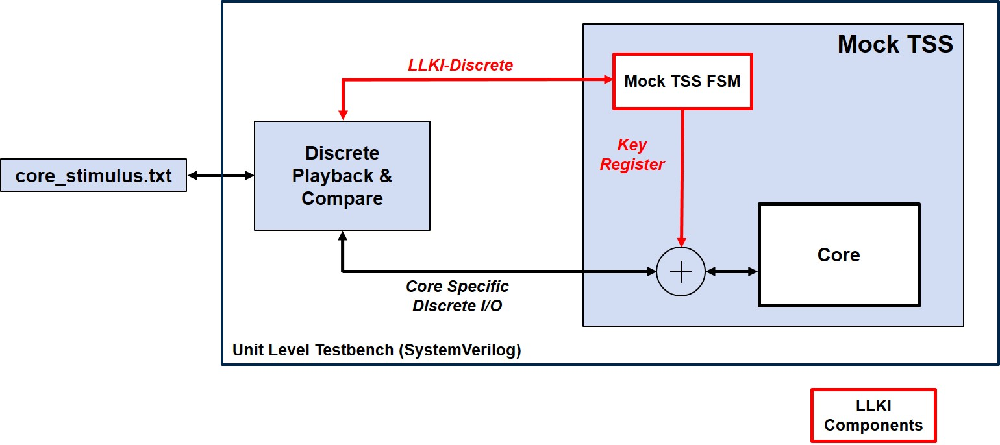

[//]: # (Copyright 2021 Massachusetts Institute of Technology)
[//]: # (SPDX short identifier: BSD-2-Clause)

   Copyright 2021 Massachusetts Institute of Technology

## Unit Simulation README

    

    

This directory contains everything to support 2 different types of unit simulations:

1. Individual cycle-level unit testbenches where stimulus are applied at the core's IOs and core's output are checked every cycle. The testbench for each core simulation is individually tailored and the DUT is the HW core's Mock Technique Specific Shim.

Change to the `<core>_sim` directory and execute the `make` command.

2. Individual transaction-level unit testbenches where tilelink read/write commands are used. Under this enviroment, the DUT is the tilelink module that wraps the core's RTL. This tileLink module is extracted from the CEP Chisel generated verilog. See [README](../TL_level_sim/README.md) for more information.

Alternatively, you can run all simulations (cycle-accurate as well as transaction-accurate) by executing `make` in the current directory.

### LLKI packet format (Transaction-level testbenches) ##

The transactional-level testbenches replay transactions mastered by the Surrogate Root of Trust (SRoT) sent via the LLKI Key Load interface.

Details on the message format can be found in the comments of `<CEP_ROOT>/hdl_cores/llki/llki_pkg.sv`.

#### Return to the root CEP [README](../README.md)
